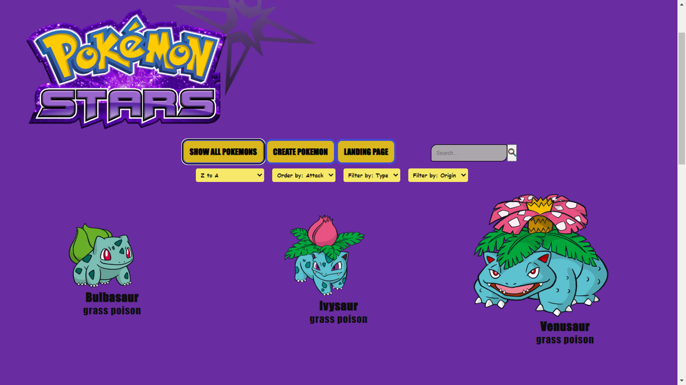

# Individual Project - Pokemon App

This project is a SPA that consumes information from the pokemon API: https://pokeapi.co/ and allows you to create and delete new pokemons as well as search by the exact name for any pokemon, filter by type or origin (database or API), sort alphabetically or by attack points.

- The application was developed using React, Redux in Frontend, Node.js with Express in Backend and for the database, PostgreSQL and Sequelize were used.

- The styles were made with pure CSS and responsive design; it also has a pagination with previous, next and input buttons showing a maximum of twelve pokemons per page.

